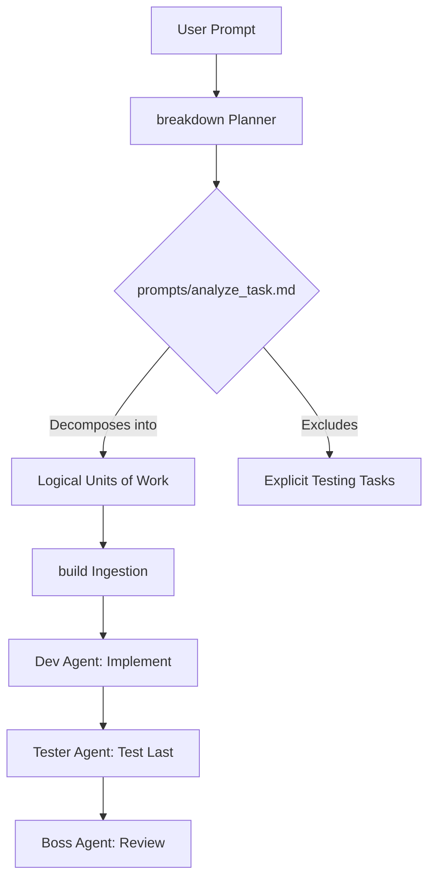

# User Story

**Headline:** Shift breakdown to Logical Units of Work (LUoW) and a Test-Last paradigm.

**Problem Statement:** The `breakdown` tool currently generates highly granular, single-file edit tasks and embeds instructions for red-green-refactor TDD. This clashes with the `build` orchestrator's workflow, which uses a multi-agent pipeline (`Dev -> Tester -> Boss`). Granular tasks prevent the `Dev` agent from building cohesive features across multiple files, and explicit testing tasks cause redundancy since the `Tester` agent automatically handles testing after the `Dev` finishes.

**Objective:** Update `breakdown`'s internal prompt and documentation to redefine an "Actionable" task as a complete "Logical Unit of Work" (LUoW) rather than a single file edit. Additionally, explicitly instruct the planner *never* to generate dedicated testing tasks, deferring testing to the `build` orchestrator's test-last pipeline.

**Expected Outcome:** When a user runs `breakdown`, the resulting task tree contains leaf nodes that represent cohesive feature slices. AI agents ingesting this plan into `build` will have the appropriate context to write the implementation completely before the `Tester` agent independently verifies it.

---

## Pending
- Update `prompts/analyze_task.md`
- Update `agent_docs/01_orientation/README.md`
- Update `agent_docs/03_deep_dives/planning_workflow.md`

## Current

## Completed

---

# Architecture Overview

**File Tree:**
```text
breakdown/
├── prompts/
│   └── analyze_task.md
└── agent_docs/
    ├── 01_orientation/
    │   └── README.md
    └── 03_deep_dives/
        └── planning_workflow.md
```

**Mermaid Diagram:**


---

# Checklist & TDD Requirements

**Legend:**
- `[PROMPT]` - System prompt modifications
- `[DOCS]` - Documentation updates

**Checklist:**
- [ ] `[PROMPT]` Modify `prompts/analyze_task.md`: Redefine "Actionable" tasks from "single file edits" to "Logical Units of Work (LUoW)" that encompass all files necessary for a functional slice.
- [ ] `[PROMPT]` Modify `prompts/analyze_task.md`: Add explicit instructions forbidding the creation of testing, QA, or validation tasks, explaining that testing is handled downstream in a "test last" pipeline.
- [ ] `[DOCS]` Update `agent_docs/01_orientation/README.md`: Revise the "Mindset for Users & AI Agents" section to highlight the LUoW approach and explain the synergy with `build`'s `Dev -> Tester` workflow.
- [ ] `[DOCS]` Update `agent_docs/03_deep_dives/planning_workflow.md`: Ensure the deep dive accurately reflects the new decomposition criteria (LUoW instead of single files) and the omission of testing tasks.

*Note: As these changes apply to markdown files and prompts, traditional unit tests do not apply. Verification should be done by running a sample `breakdown` execution and inspecting the generated plan.*

---

# Agent Instructions for Implementation

- Read-Analyze-Explain-Propose-HALT!
- Only edit one file at a time.
- Do not edit a file without a test. *(Note: Since this work only involves Markdown files, strict code TDD is bypassed, but changes must be verified for accuracy).*
- Prove tests pass before moving to the next file.